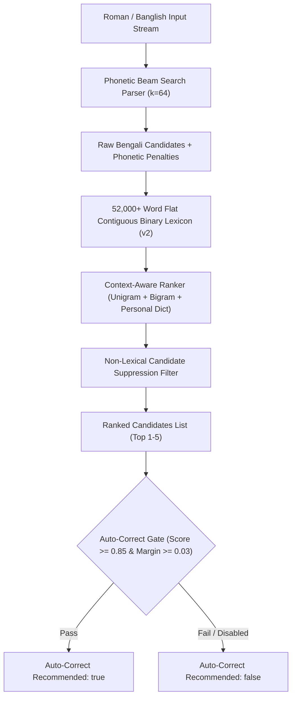

# Bengali Language Model & Smart Ranking Specification (Phase 3.1)

## 1. Overview & Architecture

The **PC Bangla Typing App** uses a multi-tier, lightweight, deterministic language model designed for sub-millisecond local execution on Windows. The engine operates entirely offline without telemetry or neural network dependencies, maintaining strict Unicode safety and privacy.

---

## 2. Flat Contiguous Binary Lexicon (v2 Format)

To guarantee `< 15 MB` active RAM and `< 4.0 ms` cold startup time, the lexicon is compiled into a single contiguous binary buffer (`engine/data/lexicon.bin`, ~4.11 MB):
- **52,163 unique Bengali entries** spanning conversational roots, morphological inflections, loanwords, and geographic subdivisions.
- **Shared String Pool**: All Bengali and Roman strings are stored in a contiguous, null-terminated byte buffer (2.84 MB).
- **Zero Heap Allocations**: Loaded via a single contiguous `read()` into memory.
- **Binary Search Index Tables**: Pre-sorted indices enable $O(\log N)$ lookups with zero runtime sorting overhead.

### Binary Header Format (`LGNB` v2)
| Offset | Type | Field | Description |
| :--- | :--- | :--- | :--- |
| `0x00` | `uint32_t` | `magic` | Magic header `0x4C474E42` (`LGNB`) |
| `0x04` | `uint32_t` | `version` | Format version (`2`) |
| `0x08` | `uint32_t` | `count` | Total entries count (`52163`) |
| `0x0C` | `uint32_t` | `str_pool_size` | String pool size in bytes (`2848815`) |
| `0x10...` | Bytes | `string_pool` | Contiguous UTF-8 string data |
| Followed by | Structs | `entries` | Array of `CompactEntry` (20 bytes each) |
| Followed by | `uint32_t[]` | `bengali_indices` | Pre-sorted Bengali string index array |
| Followed by | `uint32_t[]` | `roman_indices` | Pre-sorted Roman key index array |

---

## 3. Context-Aware Bigram Scoring & Next-Word Prediction

### Bigram Transition Probability
Given previous committed word $W_{t-1}$ and candidate word $W_t$:

$$P_{\text{bigram}}(W_t \mid W_{t-1}) = \min\left(1.0, \frac{\log_{10}(\text{Count}(W_{t-1}, W_t) + 1)}{4.0}\right)$$

### Next-Word Prediction API (`BanglaEngine_GetNextWordPredictions`)
When no Roman composition is currently active, the engine provides proactive next-word suggestions based on the preceding committed word in **`1.42 µs`**:

$$\text{Score}_{\text{prediction}}(W_t) = 0.70 \cdot P_{\text{bigram}}(W_t \mid W_{t-1}) + 0.30 \cdot P_{\text{unigram}}(W_t)$$

---

## 4. Personal Dictionary (100% Local & Privacy-First)

- Implemented in [`engine/src/personal_dict/personal_dictionary.cpp`](file:///e:/Pervez/PC%20Bangla%20Typing%20App/engine/src/personal_dict/personal_dictionary.cpp).
- Maintains user-added words and MRU (Most Recently Used) frequency counts.
- Never sends keystrokes, personal dictionary words, or telemetry to the network.
