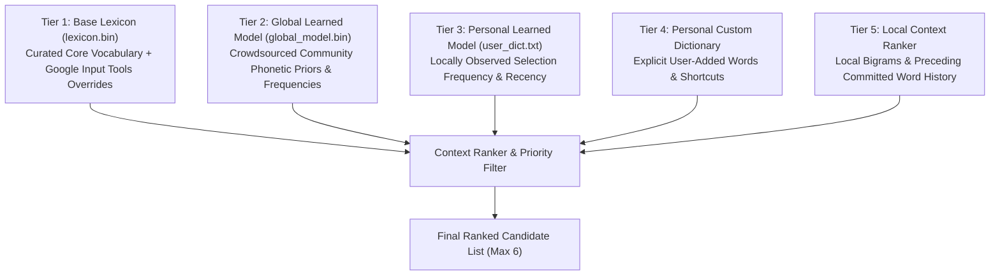
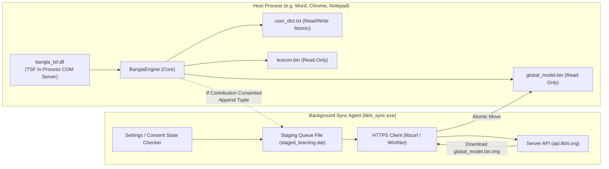
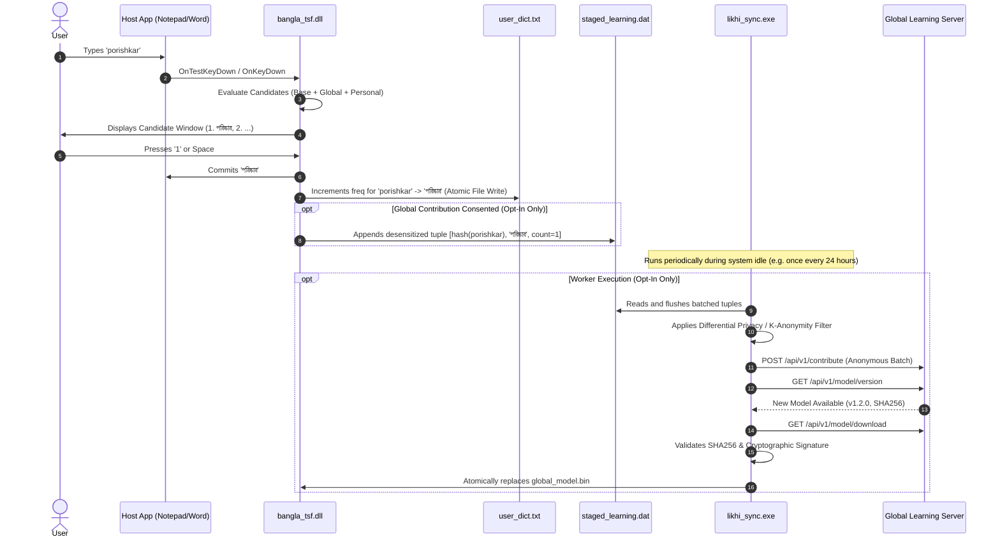

# LIKHI — STAGE 3 ARCHITECTURE SPECIFICATION
## GLOBAL & PERSONAL LEARNING ARCHITECTURE (LOCAL-FIRST & PRIVACY-PRESERVING)

**Document Version:** 1.0.0  
**Status:** DRAFT SPECIFICATION (Architecture Design Only — No Implementation)  
**Target:** Likhi (লিখি) Windows Typing System  

---

## 1. EXECUTIVE SUMMARY & GUIDING PRINCIPLES

Stage 1 and Stage 2 delivered a rock-solid, production-verified offline Bangla typing engine for Windows (TSF integration, Unicode integrity, candidate selection 1–6, Microsoft Office 2016 compatibility, and atomic personal dictionary persistence).

Stage 3 defines the **Global Learning Architecture**: how Likhi evolves and improves its phonetic mapping, ranking, and vocabulary over time by aggregating user-selected suggestions across the community, **without ever compromising user privacy, local autonomy, or offline reliability**.

### Non-Negotiable Core Tenets:
1. **Local-First & Offline Survival:** Likhi is 100% functional without an internet connection. The typing engine, personal learning, and candidates operate entirely from local storage. Network access is strictly supplementary.
2. **Zero In-Process Network Calls:** The core TSF in-process COM server (`bangla_tsf.dll`) loaded inside host processes (such as Word, Excel, Notepad, browsers) has **zero networking dependencies**. It performs no socket calls, HTTP requests, or IPC broadcasts during typing.
3. **5-Tier Precedence Hierarchy:** Personal preferences strictly take precedence over crowdsourced global data. The user's explicitly learned choices ($frequency \ge 3$) can never be overridden or silenced by server models.
4. **Zero Silent Telemetry:** Likhi contains no telemetry trackers, no analytics SDKs, no typing heatmaps, and no background keystroke logging.
5. **Double Opt-In Global Contribution:** Contributing anonymous signals is disabled by default. It requires explicit, informed user consent. Withdrawing consent immediately purges all staging queues.
6. **No Raw Text Transmission:** Likhi never transmits raw typing history, full sentences, document content, or clipboard data. Contributions are limited to discrete, decoupled, desensitized `(roman_key, selected_bengali)` tuples aggregated over time.

---

## 2. 5-TIER CANDIDATE PRECEDENCE ARCHITECTURE

Likhi resolves candidate suggestions using a 5-tier layered precedence model. Higher tiers override lower tiers in ranking, ensuring personal personalization while benefiting from curated language data.

### Tier Definitions & Precedence Rules:

| Tier | Component | Storage Location | Mutability | Scope | Priority Rule |
| :--- | :--- | :--- | :--- | :--- | :--- |
| **Tier 4** | **Personal Custom Words** | `%APPDATA%\PC-Bangla-Typing-App\user_dict.txt` (flags) | User explicit add/delete | Machine / User | Absolute top priority (manual user overrides). |
| **Tier 3** | **Personal Learned Model** | `%APPDATA%\PC-Bangla-Typing-App\user_dict.txt` | Automatic local update | Machine / User | Promoted to Slot #1 when $frequency \ge 3$. Never overwritten by global updates. |
| **Tier 1b** | **Curated Base Overrides** | `lexicon.bin` (`kLexiconOverrideFlag`) | Read-only / Immutable | Engine build | Preferred over base when $freq < 3$ (e.g. authoritative orthography). |
| **Tier 2** | **Global Learned Model** | `%LOCALAPPDATA%\Programs\Likhi\data\global_model.bin` | Periodic atomic replace | Global Crowd | Modulates unigram/phonetic weights when no personal preference exists. |
| **Tier 1a** | **Base Lexicon** | `lexicon.bin` | Read-only / Immutable | Engine build | Bedrock fallback dictionary. Guaranteed offline baseline. |
| **Tier 5** | **Local Context Ranker** | In-memory bigrams (`ContextRanker`) | Dynamic per sentence | Local Session | Contextual bigram boost based on immediate preceding word. |

### The Overwrite Invariant:
$$\text{Personal Preference} \succ \text{Curated Override} \succ \text{Global Model} \succ \text{Base Lexicon}$$

* If a user types `bhalo` and repeatedly selects `ভালোই` ($frequency \ge 3$), `ভালোই` will **always** appear as Candidate #1, regardless of what the global model or base lexicon dictates.
* If a user deletes a personal entry, the engine smoothly falls back to the Global Learned Model, then Base Lexicon.
* Updating `global_model.bin` **never touches or alters** `user_dict.txt`.

---

## 3. MULTI-PROCESS ARCHITECTURAL ISOLATION

To ensure maximum stability, zero security vulnerabilities inside sandboxed host applications, and absolute privacy, Likhi separates typing from synchronization across process boundaries.

### Architectural Boundaries:
1. **Host Isolation:**
   - `bangla_tsf.dll` links **only** against `kernel32.dll`, `user32.dll`, `advapi32.dll`, `ole32.dll`, and `msctf.dll`.
   - It contains **no WinSock, no WinINet, and no libcurl**.
   - It cannot open network sockets or leak keystrokes to the network under any circumstance.
2. **Background Sync Worker (`likhi_sync.exe`):**
   - Runs as a detached, low-priority background task or on-demand service.
   - Executes only when:
     - The user has explicitly checked `[x] Download global improvements` OR `[x] Contribute anonymous learning signals`.
     - The machine has an active, unmetered network connection.
     - The user is idle (not actively typing).
   - If consent is absent or disabled, `likhi_sync.exe` never runs and never connects to the network.

---

## 4. LOCAL LEARNING & GLOBAL AGGREGATION LIFECYCLE

---

## 5. COMPONENT INTERACTION SPECIFICATION

### 5.1 Phonetic Parser & Lexicon Integration
* `PhoneticParser` continues to generate roman-to-Bengali candidates via its rule-based transducer and beam search.
* `LexiconTrie` continues to provide verified Bengali lexical membership and base frequency priors.
* `global_model.bin` provides a fast memory-mapped lookup table of crowdsourced mappings:
  $$\text{GlobalScore}(R, B) = \frac{\log_{10}(\text{CrowdCount}(R, B) + 1)}{5.0}$$
  which modulates the candidate's unigram prior without altering core rules.

### 5.2 Context Ranker Integration
* The local `ContextRanker` combines:
  1. Phonetic similarity score ($W_p = 0.40$)
  2. Base Lexicon frequency ($W_u = 0.25$)
  3. Global crowd score ($W_g = 0.15$)
  4. Local bigram context score ($W_b = 0.20$)
  5. Personal dictionary boost ($W_{\text{personal}} = 0.45$ if $freq \ge 3$)
* This balances crowd intelligence with user customization and orthographic correctness.

---

## 6. VERIFICATION & SAFETY COVENANTS

* **Zero Regressions on Stage 1 & Stage 2:** All 881 existing test cases must continue to pass without modification.
* **Cold-Start Resilience:** If `global_model.bin` is missing, corrupt, or zero bytes, the engine silently ignores it and operates using `lexicon.bin` and `user_dict.txt`.
* **Zero Host App Freezes:** Any reading of `global_model.bin` is memory-mapped (`CreateFileMappingW` / `MapViewOfFile`) as read-only, preventing disk I/O stalls on the TSF UI thread.
