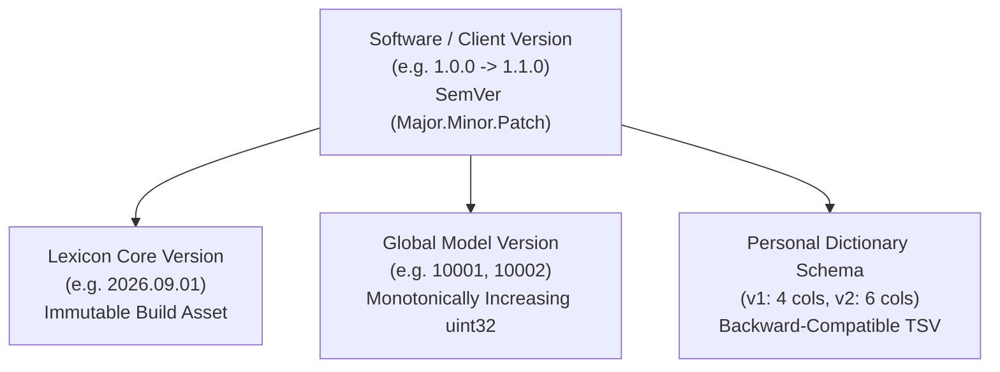
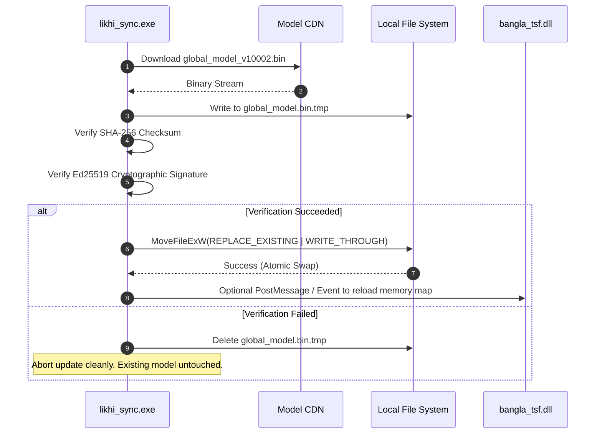

# LIKHI — STAGE 3 VERSIONING & MIGRATION SPECIFICATION
## MODEL VERSION MATRIX, ATOMIC MIGRATION & BACKWARD COMPATIBILITY

**Document Version:** 1.0.0  
**Status:** DRAFT SPECIFICATION (Migration Design Only — No Implementation)  
**Target:** Likhi (লিখি) Windows Typing System  

---

## 1. 4-DIMENSIONAL VERSIONING MATRIX

To ensure clean decoupling between software updates, dictionary updates, personal learning, and network protocols, Likhi adopts a four-dimensional versioning scheme:



### Version Dimension Definitions:

| Version Identifier | Format | Scope | Where Stored | Mutability | Upgrade Handling |
| :--- | :--- | :--- | :--- | :--- | :--- |
| `client_version` | Semantic Versioning (`1.0.0`) | Windows App | Binary Version Resource | Static per EXE/DLL | Handled by Inno Setup installer. |
| `lexicon_version` | CalVer (`YYYY.MM.DD`) | Base Vocabulary | Embedded in `lexicon.bin` | Immutable per release | Replaced with installer updates. |
| `global_model_version` | Integer (`uint32_t`) | Crowdsourced Priors | Header of `global_model.bin` | Downloaded via sync | Atomically replaced by `likhi_sync.exe`. |
| `schema_version` | Integer (`uint16_t`) | Personal Learning | `%APPDATA%\...\user_dict.txt` | Locally modified | In-place backward compatible parser. |

---

## 2. BACKWARD COMPATIBILITY & USER DICTIONARY MIGRATION

### 2.1 The Inviolable Migration Invariant
> **Under no circumstance shall an update, upgrade, reinstallation, or migration delete, truncate, or overwrite an existing `%APPDATA%\PC-Bangla-Typing-App\user_dict.txt`.**

### 2.2 Parser Evolution (v1 to v2 Migration)
In Stage 1 and Stage 2, Likhi established the 4-column TSV format:
```tsv
<roman_key>\t<bengali_word>\t<frequency>\t<last_used_timestamp>\n
```

Stage 3 introduces optional columns for extended metadata:
```tsv
<roman_key>\t<bengali_word>\t<frequency>\t<last_used_timestamp>\t<flags>\t<user_tag>\n
```

#### The Robust Reading Rule:
The parser (`PersonalDictionary::LoadFromFile`) parses each line by reading available tab tokens sequentially:
```cpp
// Column 0: roman_key (Required)
// Column 1: bengali_word (Required)
// Column 2: frequency (Optional, defaults to 1)
// Column 3: last_used_timestamp (Optional, defaults to 0)
// Column 4: flags (Optional, defaults to 0x00000000)
// Column 5: user_tag (Optional, defaults to "")
```

* **Older Likhi v1.0.0 reading a newer v2.0.0 file:** Reads columns 0–3 and cleanly ignores columns 4+. Zero crashes, zero data corruption.
* **Newer Likhi v2.0.0 reading an older v1.0.0 file:** Reads columns 0–3, applies default flags (`0`), and retains all learned words seamlessly.
* **Saving back:** When writing back to disk, existing fields are preserved, ensuring non-destructive roundtrips.

---

## 3. ATOMIC FILE REPLACEMENT & RECOVERY

When the background sync worker downloads an updated `global_model.bin`:



### Crash & Interruption Immunity:
1. `global_model.bin` is never written directly. It is downloaded to a temporary file (`.tmp`).
2. If power fails or the network disconnects midway, only the temporary `.tmp` file is corrupted, leaving the active production model 100% operational.
3. The swap uses Windows `MoveFileExW` with `MOVEFILE_REPLACE_EXISTING | MOVEFILE_WRITE_THROUGH`, guaranteeing atomic pointer exchange in the NTFS Master File Table.

---

## 4. CORRUPTION DETECTION & AUTOMATIC ROLLBACK

If `global_model.bin` is corrupted on disk (e.g. storage bit-rot or forced disk shutdown):
1. **Magic Header Check:** When `BanglaEngine` opens `global_model.bin`, it verifies the 4-byte magic signature `LGM1`.
2. **Version Compatibility Check:** It verifies `min_client_version <= CURRENT_CLIENT_VERSION`.
3. **Payload Checksum Validation:** If any header validation fails:
   - The engine logs a warning to the debug log.
   - It unmaps the file immediately.
   - It falls back 100% to `lexicon.bin` and `user_dict.txt`.
   - **Typing is never blocked, stalled, or interrupted.**
