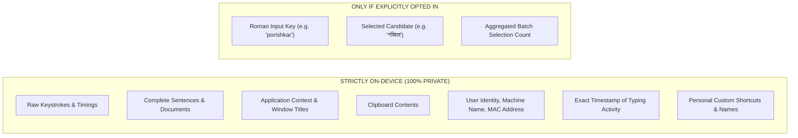

# LIKHI — STAGE 3 PRIVACY SPECIFICATION
## DATA CLASSIFICATION, CONSENT MODEL & ZERO-LEAKAGE PRIVACY DESIGN

**Document Version:** 1.0.0  
**Status:** DRAFT SPECIFICATION (Privacy Design Only — No Implementation)  
**Target:** Likhi (লিখি) Windows Typing System  

---

## 1. PRIVACY BY DESIGN PHILOSOPHY

Likhi is built on the strict premise that an Input Method Editor (IME) occupies the most sensitive position in an operating system: it observes every character a user types, including passwords, private messages, financial records, medical inquiries, and personal correspondence.

Therefore, Likhi enforces **absolute privacy by architecture**:
1. **Never upload raw typing history.**
2. **Never log or transmit full sentences or paragraphs.**
3. **Never collect document context, application window titles, or clipboard text.**
4. **Never assign persistent tracking cookies or hardware-fingerprinted user IDs.**
5. **No silent telemetry.** Likhi will not report crashes, uptime, or feature usage to external servers unless an independent, explicit user bug report is filed.

---

## 2. DATA CLASSIFICATION TAXONOMY

Every piece of data processed or stored by Likhi is strictly categorized into one of four classification tiers:

```
+-----------------------------------------------------------------------------+
| TIER A: REQUIRED LOCAL DATA (Never leaves device, essential for operation)  |
| - lexicon.bin, settings.ini, registry configurations, DLL binaries          |
+-----------------------------------------------------------------------------+
| TIER B: OPTIONAL LOCAL LEARNING DATA (Never leaves device, local only)     |
| - user_dict.txt (local candidate frequency, local recency timestamps)       |
+-----------------------------------------------------------------------------+
| TIER C: OPTIONAL CLOUD CONTRIBUTION (Explicit Opt-In, Anonymized, Batched)  |
| - Desensitized (roman_key, selected_bengali) frequency tuples (k >= 50)     |
+-----------------------------------------------------------------------------+
| TIER D: NEVER-UPLOAD DATA (Strictly forbidden from leaving device forever)  |
| - Keystrokes, full sentences, passwords, unselected text, timestamps, IDs  |
+-----------------------------------------------------------------------------+
```

### Detailed Field-by-Field Classification Matrix:

| Field / Asset | Classification | Storage Location | Retention | Leaves Device? | User Consent Required? | Purpose |
| :--- | :--- | :--- | :--- | :--- | :--- | :--- |
| `lexicon.bin` | **Tier A (Required)** | Program Files / LocalAppData | Permanent | **NEVER** | None (Core engine asset) | Phonetic mapping & dictionary lookup. |
| `settings.ini` | **Tier A (Required)** | `%APPDATA%\PC-Bangla-Typing-App` | Permanent | **NEVER** | None (User preferences) | Stores user toggle states (e.g. font size). |
| `user_dict.txt` | **Tier B (Local Learning)** | `%APPDATA%\PC-Bangla-Typing-App` | User-managed | **NEVER** | Yes (Personal Learning toggle) | Adapts suggestion ranking to personal style. |
| `staged_learning.dat` | **Tier C (Staged Signals)** | `%LOCALAPPDATA%\Likhi\staged` | Max 24 hours | Undergoes scrubbing before upload | Yes (Explicit double opt-in) | Local queue for crowd contribution batching. |
| `(roman, bengali)` Tuple | **Tier C (Cloud Contribution)** | In-memory during sync | Ephemeral | **ONLY if opted in** | **YES (Double Opt-In)** | Improves global phonetic candidate ranking. |
| Raw Keystroke Stream | **Tier D (Forbidden)** | Transient volatile RAM | Cleared on keyup | **NEVER** | N/A (Absolute Prohibition) | N/A |
| Full Sentences / Context | **Tier D (Forbidden)** | Transient volatile RAM | Cleared on space/punct | **NEVER** | N/A (Absolute Prohibition) | N/A |
| Password Field Input | **Tier D (Forbidden)** | Ignored by TSF | 0 ms | **NEVER** | N/A (Absolute Prohibition) | TSF bypasses composition in password fields. |
| User Identity / Hardware ID | **Tier D (Forbidden)** | Nowhere | Never generated | **NEVER** | N/A (Absolute Prohibition) | Preserves complete cryptographic anonymity. |
| Source IP Address | **Tier D (Forbidden)** | Server network layer | Discarded after TCP connection | Stripped at edge proxy | N/A (Never logged in database) | Network transport only. |

---

## 3. EXPLICIT CONSENT MODEL & USER CONTROLS

Likhi rejects dark patterns, pre-checked boxes, and buried privacy disclosures. All learning options are clearly separated in the **Likhi Settings** interface:

```
+-----------------------------------------------------------------------------+
|                          LIKHI PRIVACY & LEARNING                           |
+-----------------------------------------------------------------------------+
|                                                                             |
| [X] Personal Learning (Recommended)                                         |
|     Likhi learns your preferred words and ranks them higher on this PC.    |
|     All data is stored locally in user_dict.txt and NEVER leaves your device.|
|                                                                             |
| [ ] Download Global Improvements                                            |
|     Periodically download updated vocabulary and spelling corrections       |
|     crowdsourced from the community. (Read-only download, no data shared). |
|                                                                             |
| [ ] Contribute Anonymous Suggestions (Explicit Opt-In)                     |
|     Help make Likhi better for everyone. Likhi will anonymously share only  |
|     which Bengali word you selected for an English spelling.               |
|     * Zero personal identification                                          |
|     * Zero full sentences or documents                                      |
|     * No passwords or sensitive inputs                                      |
|                                                                             |
| [ ] Cloud Sync Across My Devices (Coming in Stage 4)                        |
|     Sync your personal vocabulary across your own Windows devices using     |
|     end-to-end encrypted backup.                                            |
|                                                                             |
| --------------------------------------------------------------------------- |
| User Data Management:                                                       |
| [ View Learned Words ]   [ Export Dictionary ]   [ Clear All Learned Data ]  |
+-----------------------------------------------------------------------------+
```

### Consent Invariants & Safeguards:
1. **Privacy-Safe Defaults:**
   - Personal Learning: **ON** (strictly local file on user's disk).
   - Download Global Improvements: **OFF** (opt-in).
   - Contribute Anonymous Suggestions: **OFF** (explicit opt-in required).
   - Cloud Sync: **OFF** (explicit opt-in required).
2. **Immediate Revocation Effect:**
   - If a user unchecks *Contribute Anonymous Suggestions*, the background worker immediately terminates any active sync job, deletes `%LOCALAPPDATA%\Likhi\staged\staged_learning.dat`, and resets the staging buffer to zero bytes.
3. **Right to Inspect & Audit:**
   - The user can click `[ View Learned Words ]` to view the plain-text `%APPDATA%\PC-Bangla-Typing-App\user_dict.txt` in Notepad or an integrated viewer. There are no hidden, encrypted, or obfuscated databases.
4. **Right to Erasure (One-Click Wipe):**
   - Clicking `[ Clear All Learned Data ]` deletes `user_dict.txt` and resets the engine's in-memory personal model to the fresh factory default without requiring application reinstallation.

---

## 4. WHAT LEAVES THE DEVICE VS. WHAT NEVER LEAVES

### Summary Table:



### Strict Sanitization Pipeline Before Contribution:
Before any tuple `(roman, bengali)` is placed into the staging queue for upload:
1. **Entropy & Length Filter:**
   - If `roman_key` has $> 24$ characters, it is discarded (avoids accidental paste of URLs, base64 strings, or tokens).
   - If `roman_key` contains mixed digits or symbols (e.g. `pass123!`, `01711...`), it is discarded.
2. **Proper Noun / Sensitivity Filter:**
   - If the candidate was typed only once or twice, it is **never** uploaded. Only words selected $\ge 3$ times across multiple sessions qualify for candidate contribution.
   - If the Bengali word is not recognized by phonetic rules and appears to be a unique personal identifier (e.g. national ID numbers, account names), it is discarded.
3. **Time Bucket Quantization:**
   - No granular timestamps (e.g. `2026-09-09 16:35:12`) are ever included. Upload batches are tagged with coarse day-level buckets (`2026-W37`), preventing behavioral profiling.

---

## 5. REGULATORY COMPLIANCE & ETHICAL ALIGNMENT

* **GDPR & CCPA Alignment:**
  - **Article 5(1)(c) Data Minimisation:** Likhi collects only what is strictly necessary to train the n-gram language model.
  - **Article 17 Right to Erasure:** Complete local and remote erasure supported.
  - **Article 25 Data Protection by Design and by Default:** Default state is completely offline.
* **Open Source Verifiability:**
  - All networking code, payload serialization, and staging algorithms are open-source and auditable. Independent researchers can verify via Wireshark that no unexpected network traffic leaves the machine.
