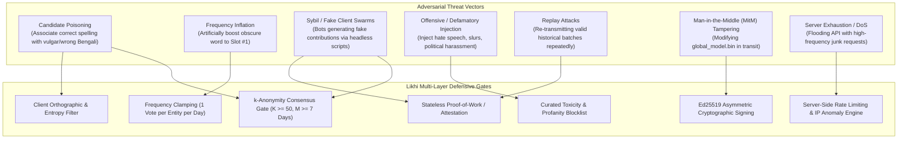

# LIKHI — STAGE 3 SECURITY & ABUSE MITIGATION SPECIFICATION
## ADVERSARIAL THREAT MODEL, DEFENSIVE GATES & MODEL INTEGRITY

**Document Version:** 1.0.0  
**Status:** DRAFT SPECIFICATION (Security Architecture Design Only — No Implementation)  
**Target:** Likhi (লিখি) Windows Typing System  

---

## 1. THREAT LANDSCAPE & ADVERSARIAL VECTORS

A public or crowdsourced learning engine is vulnerable to malicious actors attempting to poison dictionary suggestions, promote hate speech, artificially inflate product names, or disrupt service.

Likhi models the following specific attack scenarios:

---

## 2. MULTI-LAYER DEFENSIVE GATES

### Gate 1: Client-Side Pre-Submission Orthographic Sanitization
Before any contribution is packaged on the user's PC:
* **Bengali Unicode Integrity Filter:** The Bengali word must conform to Unicode standard ranges (`U+0980`–`U+09FF`), pass `UnicodeUtils::IsValidBengaliSequence`, contain no dangling Hasants (`U+09CD` at word boundary), and contain no illegal Nukta/Khanda-Ta placements.
* **Phonetic Plausibility Check:** The word must produce a minimum alignment score ($score \ge 0.40$) through Likhi's `PhoneticParser`. Arbitrary, random strings (e.g. `asdf` $\to$ `বাংলাদেশ`) are rejected locally.
* **Length & Character Set Constraints:** Roman key restricted to `[a-z]` only, length between 1 and 24 characters. All digits, punctuation, and uppercase characters are rejected.

### Gate 2: Sybil & Automation Mitigation (Proof-of-Work & Attestation)
To prevent automated headless botnets from flooding the API:
* **Stateless Proof-of-Work (PoW):** The server issues a challenge (e.g., finding a SHA-256 nonce with 18 leading zeros) requiring $\sim 100$–$200$ ms of client CPU time per batch. This makes high-volume bot submissions computationally expensive while remaining imperceptible to a human user's PC during background sync.
* **Contribution Bounding:** A single client is permitted at most **one batch of $\le 20$ candidate pairs per 24-hour calendar window**.

### Gate 3: Frequency Clamping & Anti-Inflation
* **The "One-User-One-Vote" Invariant:** Regardless of how many times a user types a word locally (e.g. 5,000 times), their client may contribute a weight of **at most 1** for that `(roman, bengali)` pair in any 24-hour reporting cycle.
* An attacker with a single client cannot artificially inflate a candidate's global frequency.

### Gate 4: k-Anonymity Statistical Consensus Gate ($K \ge 50$, $M \ge 7$ Days)
No contributed word or candidate mapping is EVER directly published into `global_model.bin` automatically.
To graduate into the global model, a candidate pair must satisfy the **Strict Consensus Formula**:

$$\text{Eligibility}(R, B) \iff \sum_{i=1}^{K} \text{Client}(i) \ge 50 \quad \text{AND} \quad \Delta t_{\text{span}} \ge 7 \text{ days} \quad \text{AND} \quad \text{ToxicityScore}(B) == 0$$

* **$K \ge 50$ Unique Sessions:** The mapping must be independently submitted by at least 50 distinct cryptographic sessions.
* **Time Span $\ge 7$ Days:** The submissions must span at least 7 distinct calendar days, preventing flash-mob attacks.
* **Entropy Distribution:** Contributions must not originate from a single IP subnet (Max 10% from any single `/24` IPv4 or `/48` IPv6 block).

### Gate 5: Toxicity, Defamation & Hate Speech Shield
* **Curated Blocklist:** The aggregation pipeline maintains an authoritative blocklist of known slurs, abusive vocabulary, sexual harassment terms, and defamatory phrases.
* **Human-in-the-Loop Vetting for New Words:** Any word that does not exist in the base `lexicon.bin` and reaches the $K \ge 50$ threshold is routed to a staging queue for manual lexical review before being compiled into the official binary model.

### Gate 6: Cryptographic Model Integrity (Ed25519 Signing)
To eliminate the risk of corrupted or tampered models being distributed via compromised CDNs or MitM attacks:
* Every compiled `global_model.bin` is cryptographically signed at build time using a private **Ed25519** signing key held in offline hardware security modules (HSM).
* The Likhi client embeds the corresponding **Ed25519 Public Key**.
* Before applying an updated model:
  1. The client verifies the SHA-256 checksum against the signed manifest.
  2. The client validates the Ed25519 signature of `global_model.bin`.
  3. If verification fails, the file is deleted immediately, and the client continues using the existing model.

---

## 3. SERVER SECURITY & RESILIENCE

### 3.1 Rate Limiting Architecture
* **Edge Proxy (Cloudflare / Nginx / Envoy):**
  - IP Rate Limit: Maximum 10 requests per minute per IP address.
  - Global Ingestion Limit: Maximum 1,000 requests per second cluster-wide.
  - Payload Size Limit: Maximum 32 KB per submission batch. Any request exceeding 32 KB is rejected with HTTP 413.

### 3.2 Ephemeral Data Pipeline
* The server stores contribution submissions in an ephemeral memory buffer (Redis/Kafka) for statistical aggregation.
* IP addresses are decoupled from payloads at the edge proxy and discarded immediately upon TCP teardown.
* No long-term logs containing user IP addresses or submission timestamps are retained.

---

## 4. INCIDENT RESPONSE & EMERGENCY ROLLBACK

If an adversarial attack manages to inject an erroneous or undesirable mapping into an issued `global_model.bin`:
1. **Emergency Model Revocation:** The server increments `min_model_version` in `/api/v1/model/version` and marks the affected version as revoked.
2. **Client Instant Rollback:** The client checks the revocation list. Upon seeing its local model revoked, it instantly deletes `global_model.bin` and falls back cleanly to the immutable `lexicon.bin`.
3. **Zero Impact on Personal Typing:** The user's personal dictionary (`user_dict.txt`) remains completely unaffected and functional throughout the revocation event.
