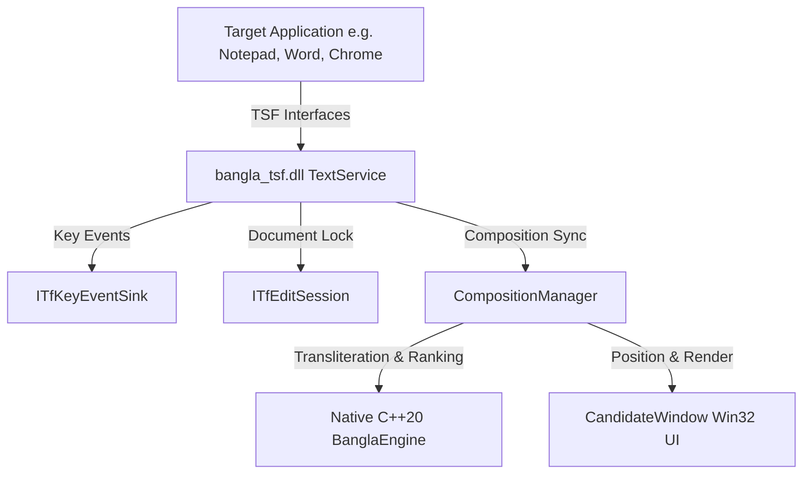

# Windows TSF Architecture & COM Implementation

## 1. Overview

The **PC Bangla Typing App** uses the modern **Windows Text Services Framework (TSF)** to provide seamless Bengali phonetic input across all Windows applications. It is packaged as an in-process COM DLL (`bangla_tsf.dll`) loaded directly into client target processes.

---

## 2. In-Process COM Class & GUIDs

- **Text Service CLSID**: `{B4F1470A-7C69-4C62-972F-6379532856E1}` (`CLSID_BanglaTextService`)
- **Profile GUID**: `{D85B64E2-0D5C-40EE-BE15-1E7C146603F2}` (`GUID_BanglaProfile`)
- **Language ID**: `0x0445` (Bengali - Bangladesh) & `0x0845` (Bengali - India)
- **Category GUIDs**:
  - `GUID_TFCAT_TIP_KEYBOARD`
  - `GUID_TFCAT_DISPLAYATTRIBUTEPROVIDER`

---

## 3. Core TSF Interfaces Implemented

### 3.1. `ITfTextInputProcessor`
- Manages IME activation (`Activate`) and deactivation (`Deactivate`).
- Acquires `ITfThreadMgr` and `TfClientId`.
- Connects sinks (`ITfThreadMgrEventSink`, `ITfKeyEventSink`).

### 3.2. `ITfKeyEventSink`
- Intercepts keystrokes via `OnTestKeyDown`, `OnKeyDown`, `OnTestKeyUp`, `OnKeyUp`.
- Gathers Roman keystrokes (`a-z`, `A-Z`, numbers, backspace, space, enter, punctuation).
- Sets `*pfEaten = TRUE` when processing internal phonetic composition.

### 3.3. `ITfCompositionSink`
- Tracks the lifecycle of active text composition.
- Cleans up internal state when composition is terminated externally via `OnCompositionTerminated`.

### 3.4. `ITfEditSession`
- Implements asynchronous / synchronous document read-write sessions (`ActionEditSession`).
- Safely alters document buffer ranges (`ITfRange::SetText`, `Collapse`, `InsertTextAtSelection`) without memory or thread conflicts.

---

## 4. No Global Hooks or keystroke Injection

The implementation strictly avoids:
- `WH_KEYBOARD_LL` global keyboard hooks
- Keystroke synthesis / injection (`SendInput`, `keybd_event`)
- Background polling loops
- Electron, Python, or .NET runtimes in client processes
