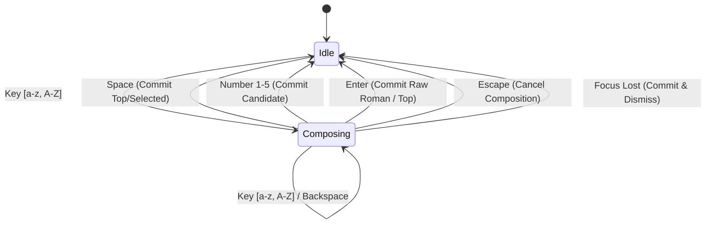

# Windows TSF Integration Guide

## 1. Overview

This document details how the native C++20 language engine connects to the Windows TSF text store.

---

## 2. Text Service Registration Flow

1. **COM Server Registration (`RegisterCOMServer`)**:
   - Registers `InprocServer32` at `HKCR\CLSID\{B4F1470A-7C69-4C62-972F-6379532856E1}`.
   - Sets `ThreadingModel = Apartment`.
2. **TSF Category & Profile Registration (`RegisterTSFProfiles`)**:
   - Calls `ITfInputProcessorProfiles::Register(CLSID_BanglaTextService)`.
   - Adds language profile for Bengali (`0x0445`).
   - Calls `ITfCategoryMgr::RegisterCategory` for keyboard TIP and display attributes.

---

## 3. Key Processing State Machine

---

## 4. Caret Tracking & Candidate Window Placement

- Retrieves `ITfContextView` via `ITfContext::GetActiveView`.
- Calls `ITfContextView::GetTextExt(0, pCompositionRange, &rc, &fClipped)` to query exact on-screen pixel coordinates of the active composition range.
- Shifts candidate window directly beneath the baseline with multi-monitor / screen-boundary clamping.
- Creates candidate popup window with `WS_EX_NOACTIVATE` and `WS_EX_TOPMOST` to avoid stealing focus from the active text editor.
